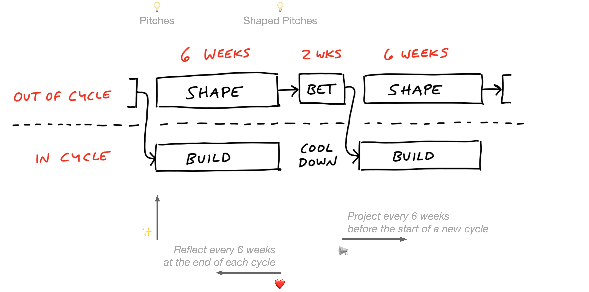

<a href="README.md">Home</a> | <a href="holidays-and-absences.md">Back</a> | <a href="organizational-chart.md">Next</a>

# How We Work
First of all, we would like to highlight that this section is based on its homonymous counterpart of the *Basecamp Employee Handbook*.

Said that, at GRAPIN we also think about how to break big projects into smaller pieces, such that they can be done in a *resonable* amount of time. In the context of Basecamp and [Shape Up (last seen 22.02.2020)](https://basecamp.com/shapeup), this smaller pieces are called cycles.

## Cycles
In our case, the duration of the cycle will depend on the nature of each project, but it should cover an amount of work that can be completed within 4- and 8-weeks.

Fixing this cadence over a project serves to give us an internal sense of urgency, work as a [scope hammer](scope-hammering.md) on the scopes to keep projects from ballooning, and provide a regular interval to decide what we are working on. 

Work is thus limited by a budget, and the budget focuses our discussion about what’s resonable and what’s not. When a project starts slipping on its budget, the first approach should be to [judo](judo.md) the problem and scope hammer the domain—and certainly not make it up by working more hours! Most things we work on can fit within four to eight weeks.

We make use of the cycles using a Basecamp plug-in called [Tracked](https://www.trackedhq.com). Please see the [Tools](/tools.md) section for more details.

## Cooldown
In between each cycle, we spend between one or two weeks cooling down (one week for 4-week cycles, and two for the rest). That’s the time to deal with bugs or smaller issues that come up, write up what we worked on, and find out what we should tackle next. 

It’s sometimes tempting to simply extend the cycles into the cooldown period to fit more work. But the goal is to resist this temptation and put the "pencils down". That means that by week 4 of a 6-week cycle, we should be winding down, getting ready to launch, and make sure everything is lined up.

## Communication
It’s hard to keep up on what everyone is doing and what it means, if you just watch the stream of latest activity scrolling along on the Basecamp Activity. (It’s also a waste of time and source of stress to even try.) Instead, we have four chief mechanisms for keeping everyone in the loop about the work that’s going on:

1. There’s the daily question of **What did you work on today?** They’re a great conversation starter if you see someone working on something you either care about or want to learn more about. Use them as such! You're obliged to answer this question at least twice a week when you're not out.

2. There’s the weekly question of **What will you be working on this week?**, which details your intentions for the coming week. Everyone is obliged to answer this question when they're not out.

3. There is the heartbeats. These are the team versions of *What did you work on this cycle?* This is where we summarize and celebrate the work that's been done. Every team lead is obliged to write, or designate someone on the team to write, this account one week after a cycle has ended.

4. There is the kickoffs. These are the team version of *What are you going to work on next cycle?* This is where the plan for the coming weeks is presented. Every team lead is obliged to write, or designate someone on the team to write, this account before the start of the new cycle.

These mechanisms work together to free individuals and teams to run their days and cycles with confidence and independence. By having clear expectations for communication, it's easier for everyone to build trust in where we're going and why.

## Pitches
Whether you work on the product development or not, your voice and observations can help determine what we should be working on. The way to exert this influence is through pitches.

Write-up your idea of a new feature, a change to a feature, or any other product development you think we should be considering as a fully considered post (the more specific, the better). This gives the whole company a chance to consider and respond to the idea, and then we'll have the idea encapsulated in a post, available for reference at any time.

It is important to have realistic expectations about what will happen after you posted a pitch:

* Everyone involved with the product development will read your pitch, and that is a win right there: even if the full pitch does not make it, it can impact other product decisions,

* Occasionally few pitches would appear directly for the next cycle, but

* It's more likely that your pitch will sit for a while first.

Don't be discouraged by the later case! There are always more ideas than time, and we can only get a few things done each cycle.

There will be a designated team per project evaluating pitches for inclusion in the next cycle. Before the start of every cycle, the team lead kickoff will list all the pitches that have been selected to be worked on.

## Asynchronously
We have people working all sorts of different hours and places. That alone makes it hard to enforce a lot of tightly-coupled workflows during the day, but that’s a feature not a bug. Most of the work you do shouldn’t require you to be in constant communication throughout the entire day with someone.

It’s far better for everyone’s concentration and sanity if you collaborate as though most things will get an answer eventually, but not necessarily right this second. Your first choice of action should be:

1. To post a message,
2. To create a todo, or
3. Write down a document about what you need to explain or need to know.

Then others can read it on their schedule, when the natural lulls of the day allow it, rather than being interrupted right in their peak flow time.

Don’t take that as gospel, though. Some times you really DO need to tightly collaborate with someone for an extended period of time, and that’s fine. For that we have (folowing the above *priorization* list):

4. Basecamp pings, 
5. Basecamp campfires, or 
6. Hangouts, screensharing, or even in-person collaboration for when nothing else will do.

## In Self-Sufficient, Independent Teams
Organizational theory is thick with descriptions of the trade-offs between functional and project company structures. As guidelined by Basecamp, we also seek to be more project than functional. This means a single project team should be able to go from idea to deploy as independently as possible.

## With Managers of One
We encorage to do a lot of self-management. People who do this well qualify as "managers of one", and we strive for everyone senior or above to embody this principle fully.

That means setting your own direction when one isn't given. Determining what needs to be done, and doing it, without waiting for someone to tell you to. A manager of one will spend their time well when left to their own devices. There's always more work to be done, always more initiatives to kick off, always more improvement to be had.

## Balanced
We limit ourselves to a 42-hour work week. Keeping our hours at work limited forces us to prioritize the work that really matters.

For time tracking we have developed our own *GRAPIN’s Time Tracking Tool*. Please see sections [Holidays and Absences](holidays-and-absences.md) and [Tools](tools.md).

## Summary of the Method 

### Six week cycles, two tracks

*Shape Up Summary for a 6-week cycle*

* Build teams work in six week cycles,
* Shaping happens on a track parellel to building. It produces potential projects that are six weeks long or shorter,
* The betting table is held in the two-week cool-down between cycles. Unshaped work is considered too risky to bet on,
* Betting means a team is given six uninterrupted weeks to finish the shaped work,
* During cool-down, teams have no scheduled work. It’s slack time to deply, debrief, fix bugs, and/or lear new tech. 

Shaping work is qualitetively different from building. It’s unknown in advance which ideas will turn into bettable projects and which ones won’t. Some projects are shaped quickly, some take multiple cycles, and some never come together. What’s important is to always have some good options for the betting table before each cycle.

### Internal Communication

The picture above depicts some of the communication events previosly mentioned:

* Heartbeats ❤️: What did you worked on this cycle? The team lead will write a message after a cycle has ended informing about the work that has been completed. This message will be posted on the Message Board of a Basecamp project.

* Kickoffs 📢: What are you going to work on next cycle? The first thing in a new cycle is a kick-off message with the shaped concept. The team lead will write this message on the Message Board of a Basecamp project.

* Pitches 💡: pitches are potential bets, and are written on the Product Strategy Basecamp team. Everyone in the company can influence what we should be working on through posting pitches.

* Announcing the bets ✨: The CEO or its representative will write a message announcing the bets for the next cycle. This message will be posted on the Message Board on Basecamp’s HQ.

Some other general principles that we try to follow when communicating with teammates, within departments, across the company, and with the public, are listed here:

1. Few things are as important to study, practice, and perfect as clear communication.
2. Real-time sometimes, asynchronous most of the time.
3. Internal communication based on long-form writing, rather than verbal tradition of meetings, speaking, and chatting, leads to a welcomed reduction in meetings, video conferences, calls, or other real-time opportunities to interrupt and be interrupted.
4. Give meaningful discussions a meaningful amount of time to develop and unfold. Rushing to judgement, or demanding immediate responses only serves to increase the odds of poor decision making.
5. Meetings are the last resort, not the first option.
6. Writing solidifies, chat dissolves. Substantial decisions start and end with an exchange of complete thoughts, not one-line-at-a-time jousts. If it's important, critical, or fundamental, write it up, don't chat it down.
7. Speaking only helps who’s in the room, writing helps everyone.
8. If your words can be perceived in different ways, they'll be understood in the way which does the most harm.
9. Never expect or require someone to get back to you immediately unless it’s a true emergency. The expectation of immediate response is toxic.
10. Poor communication creates more work.

For more information, please read [The Basecamp Guide to Internal Communication (last seen 22.02.2020)](https://basecamp.com/guides/how-we-communicate). 