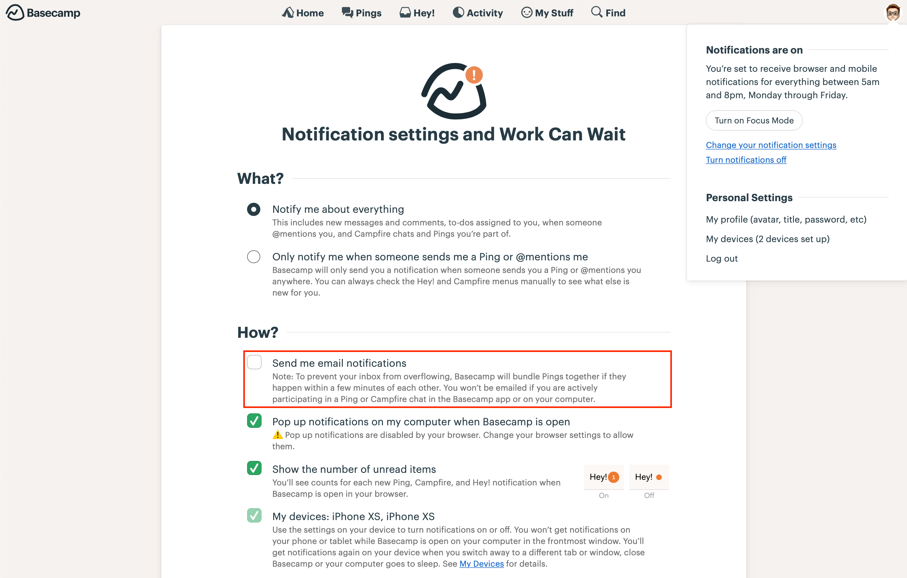
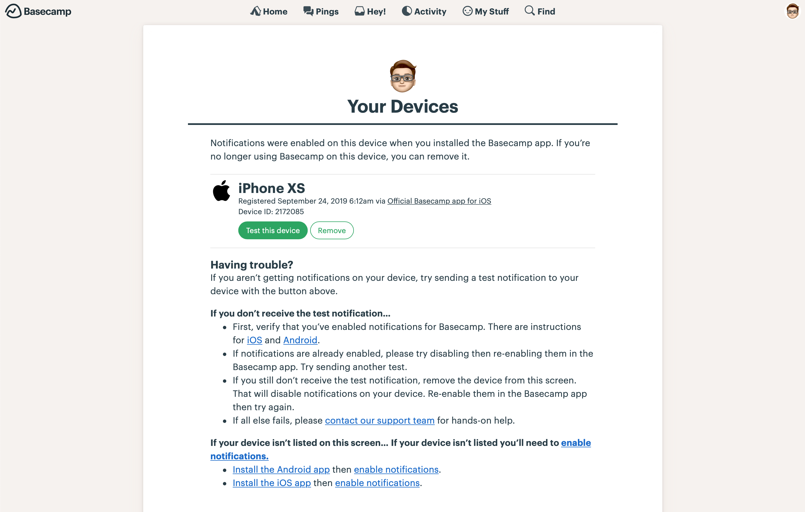
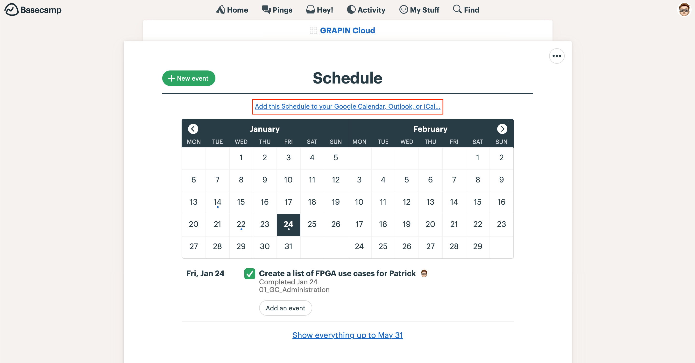

<a href="README.md">Home</a> | <a href="projects.md">Back</a> | <a href="what-we-stand-for.md">Next</a>

# Tools
At GRAPIN we use the following tools to operate the company:

* Project Management: [Basecamp](#basecamp) (includes instant messaging),
* Documentation and File Sharing: [Nextcloud](#nextcloud),
* Time-tracking: *GRAPIN’s Time Tracking Tool*—which also helps to plan tasks mapped to Basecamp—, and
* Code Management: github.

## Basecamp

Basecamp is the tool on which the majority of processes of GRAPIN as a company are defined, at both the project and communication level. Given its importance, here is a list of best practices:

1. [Install Basecamp](https://basecamp.com/via) apps on both your computer (desktop version) and your smartphone,
2. Proceed with Bascamp’s [Basic Setup](#basic-setup) by disabling email notifications, verifying the correct functioning of the notifications on your smartphone, and setting up your calendars,
3. Basecamp apps (desktop and smartphone) should be always open (or running in background) as you usually do with your favourite email client. This is very important!
4. Basecamp should replace emails for internal communications. As a first preference use messages on the Message Board for communication purposes. If you need immediate feedback, use then _pings_ or the proper Campfire. Emails are old-fashined, get lost, create bottelnecks, and they are definitely not the right tool for internal communication!
5. For meetings with only internal members, try to use Basecamp’s Schedule as much as possible. Basecamp’s Schedule events allow you to easily document meeting’s conclusions by creating cross references to people, documents, or other meetings,
6. In any case, as mentioned before, ensure to properly add your personal Basecamp’s Schedule to your GRAPIN’s Exchange (or equivalent) account, and
7. In regards to Tasks: when you create a task always asign it to someone (even if it is probably yourself!), and if possible, try to avoid to assign a task for multiple people.

### Basic Setup
As mentioned above, setting up Basecamp basically means to ensure that:

1. You disable email notifications,
2. You ensure your notifications are properly working on your smartphone, and that
3. You add your personal Basecamp’s Schedule to your GRAPIN’s Exchange (or any other calendar tool in case of customers or partners).

*Figure 1. Disabling email notifications*

*Figure 2. Smartphone notifications*

*Figure 2. Disabling email notifications*

*Figure 3. Schedule setup*

### Projects, Lists, and Tasks
In GRAPIN we think of projects as milestones. Tasks and lists are the most important things on Basecamp—as they basically collect the work to be done to achieve your goals. As mentioned above, there are some recommendations when you are creating tasks:

1. Always asign the task to someone,
2. Try to avoid to assign a task for multiple people, and
3. Try to avoid to create groups on _tasks lists_.

Besides the owner of the task, you can also select:

1. Who to notify when the task is done,
2. When the task should be completed, i.e. by entering a _Due on_, and
3. A task description.

In the case you select a _Due on_, you will see that task in both your _Basecamp Schedule_ and your _Exchange Calendar_.

As we all want to work independetly (but giving enough information to our colleagues about what we are working on), always add a description of the task on the _Notes_ section.

### Communication

There are many ways to communicate through Basecamp. In summary, you should try to follow this priorized list when you try to communicate with someone:

1. Messages,
2. ToDos,
3. Documents,
4. Pings, and
5. Campfire (not relevant topics).

As a general guideline for communications, we recommend you to read [The Basecamp Guide to Internal Communication (last seen 22.02.2020)](https://basecamp.com/guides/how-we-communicate).

### Tracked
[Tracked for Basecamp](https://www.trackedhq.com) is a plug-in that enables Kanban boards on Basecamp. This plug-in is only available for Chrome or compatible browsers.

In order to install Tracked, please do the following:

1. Install the [Chrome extension](https://chrome.google.com/webstore/detail/tracked-for-basecamp/chmeecgnmbnijigjhhgedjljgkgblmpo),
2. Ask for an email invitation to Patrick or Javi, and follow the instructions there.

Besides of the Kanban board, Tracked adds a valuable feature to us: task-labels. With this labels we are able to assign tasks from different lists to a cycles in order to implement Shape Up in our projects.

## Nextcloud

*Coming soon!*

## GRAPIN’s Time Tracking

*Coming soon!*